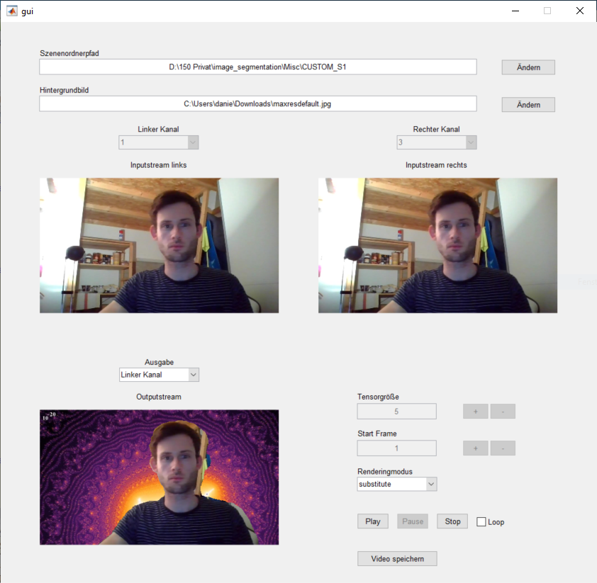
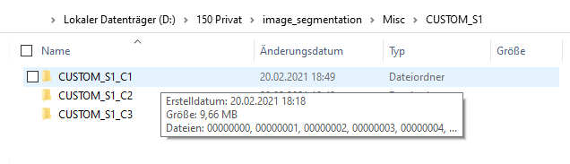
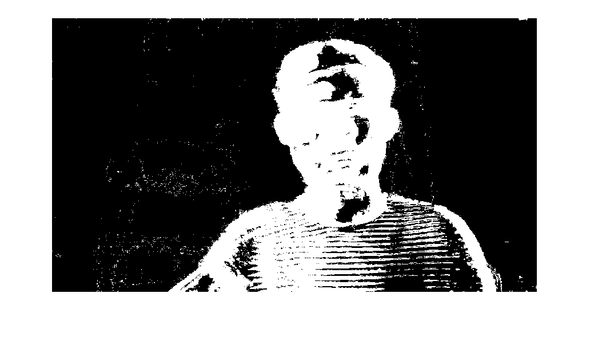
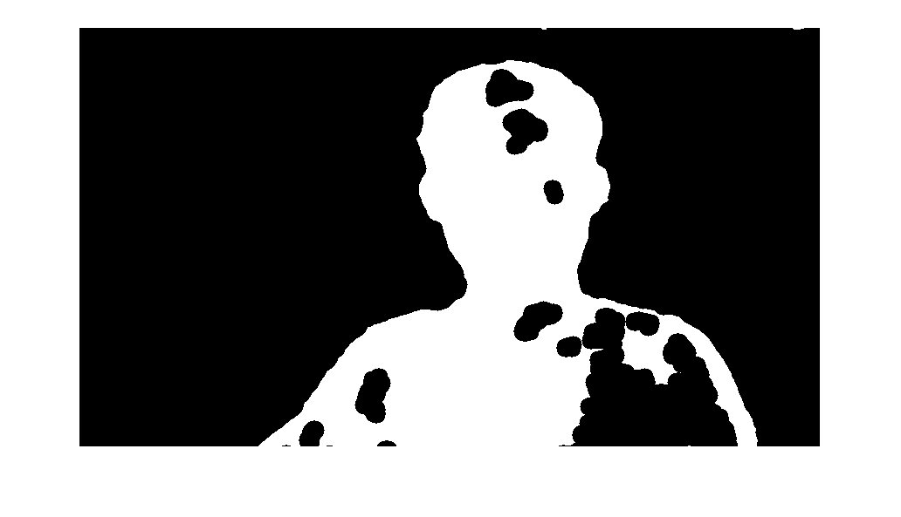

# Vordergrund/Hintergrund Videosegmentierung mit MATLAB

Mit diesem Programm kann der Hintergrund in Videosequenzen durch ein einstellbares Bild ersetzt werden.
Die Unterscheidung zwischen Vorder- und Hintergrund basiert auf dem "Universial background subtraction algorithm for video sequences"\[[ViBe2011](https://www.researchgate.net/publication/224206851_ViBe_A_Universal_Background_Subtraction_Algorithm_for_Video_Sequences)\] Algorithmus. Zusätzlich wird in einem Postprocessing Schritt Rauschen unterdrückt.
Das Projekt ist so ausgelegt, dass ohne große Anpassungen auch andere Algorithmen verwendet werden können. Dafür muss lediglich die Implementierung der Funktion `segmentation(...)` geändert werden.

## Eingabedaten

Das Programm erwartet die einzelnen Frames des Videos in einer speziellen Ordnerstruktur:
- Sequenzname_C\[Kamera Nummer 1-n\]/\[Framenummer 00000000-xxxxxxxx\].jpg

Ein großer kompatibler Datensatz ist z.B. [ChokePoint Dataset](http://arma.sourceforge.net/chokepoint/).

## Algorithmus

Im ersten Schritt wird das aktuelle Frame mit dem [ViBe2011](https://www.researchgate.net/publication/224206851_ViBe_A_Universal_Background_Subtraction_Algorithm_for_Video_Sequences) Algorithmus Pixelweise in Vorder- und Hintergrund segmentiert.

Anschließend wird die resultierende Maske tiefpassgefiltert und über eine Closing-Operation nahe beieinander liegende Vordergrundbereiche miteinander vereint.

Zum Abschluss werden kleine, isoloierte Hintergrundbereiche entfernt (als Vordergrund markiert).

